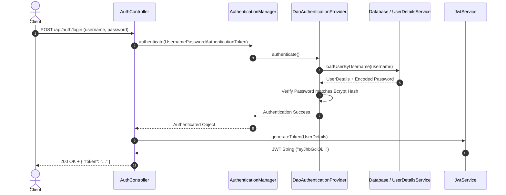
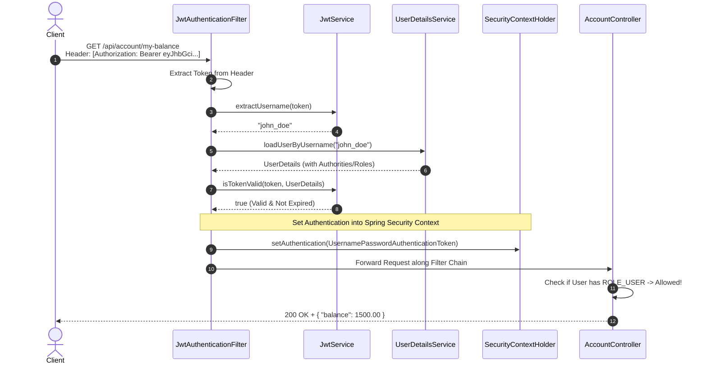

Listed directory bank

Welcome to Spring Security! Learning Spring Security with **JWT (JSON Web Tokens)** is one of the most practical skills in modern backend development, especially for stateless REST APIs.

Since your workspace directory is named `bank`, let's design a **Mini-Bank Account & Vault API**. It is small, relatable, and provides the exact right requirements to demonstrate **Authentication**, **Stateless JWT Authorization**, and **Role-Based Access Control (RBAC)**.

---

### 💡 1. Suggested Application Idea: EasyByte Mini-Bank API

We will build a simple REST API where users can open an account, check balances, and perform transactions, while Administrators can manage accounts.

#### **Endpoints & Access Rules**
| Endpoint | Method | Access Level | Description |
| :--- | :---: | :--- | :--- |
| `/api/auth/register` | `POST` | **Public** | Register a new user (`ROLE_USER` or `ROLE_ADMIN`) |
| `/api/auth/login` | `POST` | **Public** | Verify username/password and return a **JWT Token** |
| `/api/account/my-balance` | `GET` | **Protected (`ROLE_USER`)** | View the logged-in user's bank balance |
| `/api/account/deposit` | `POST` | **Protected (`ROLE_USER`)** | Deposit money into the logged-in user's account |
| `/api/admin/all-accounts`| `GET` | **Protected (`ROLE_ADMIN`)** | View all accounts in the system |

---

### 🧠 2. How Spring Security + JWT Works (Core Concepts)

Spring Security intercepts HTTP requests using a **Filter Chain (`SecurityFilterChain`)**. Before a request ever reaches your Controller, it passes through several filters that check if the request is authenticated and authorized.

In traditional web applications, the server stores a **Session** in memory after login. But with **JWT**, the application is **Stateless**—the server stores *nothing* in memory across requests. Instead:
1. When the user logs in, the server generates a cryptographically signed **JWT** containing user details (username, roles, expiration time).
2. On every subsequent request, the client sends this token in the `Authorization: Bearer <token>` header.
3. Our custom `JwtAuthenticationFilter` intercepts the request, verifies the signature, and tells Spring Security: *"This user is authenticated and has ROLE_USER!"*

---

### 📊 3. Architecture & Request Flows

#### **Flow 1: Login & Token Generation (`/api/auth/login`)**
When a user submits their credentials, Spring validates them against our database and issues a signed token.

---

#### **Flow 2: Accessing Protected Endpoints (`/api/account/my-balance`)**
Whenever the client accesses a protected endpoint, our custom **`JwtAuthenticationFilter`** sits in front of the application to validate the token.

---

### 🧩 4. Key Components We Will Build

Here is the breakdown of the classes we will design when we start coding:

1. **`JwtService`**
   - Handles low-level token operations using the `jjwt` library.
   - Responsibilities: Generating tokens with claims, extracting username (`subject`), and verifying token expiration & digital signature.

2. **`JwtAuthenticationFilter`** (extends `OncePerRequestFilter`)
   - Runs *once per every incoming HTTP request*.
   - Checks if the `Authorization` header contains `Bearer <token>`.
   - If valid, populates the `SecurityContextHolder` so Spring knows who is currently calling the API.

3. **`SecurityConfig`**
   - The central command center of Spring Security (`@Configuration` + `@EnableWebSecurity`).
   - Configures `SecurityFilterChain`: disables CSRF (since we use stateless JWT), sets session management to `STATELESS`, specifies public vs. protected URL patterns, and registers our `JwtAuthenticationFilter` before Spring's default username/password filter.

4. **`User` & `UserDetailsService`**
   - Implements Spring's `UserDetails` interface so our `User` entity seamlessly integrates with Spring Security.
   - `UserDetailsService` tells Spring how to fetch user records from our database by username/email.

---

### 🚀 5. How We Should Get Started (Step-by-Step Roadmap)

When you are ready to begin, we should tackle this in **4 manageable phases** so you can see each layer working cleanly:

- **Phase 1: Project Setup & Core Domain**
  - Initialize Spring Boot project with Spring Web, Spring Security, Spring Data JPA, H2/MySQL database, and Lombok.
  - Create the `User` entity, `Account` entity, and basic Repositories.

- **Phase 2: JWT Utility (`JwtService`) & Core Auth Configuration**
  - Add the `jjwt` dependencies (`jjwt-api`, `jjwt-impl`, `jjwt-jackson`).
  - Implement `JwtService` and test token creation/validation.
  - Create `SecurityConfig` and `UserDetailsService` with `BCryptPasswordEncoder`.

- **Phase 3: Building the Auth Controller (`/api/auth/**`)**
  - Create the `RegisterRequest`, `LoginRequest`, and `AuthResponse` DTOs.
  - Implement `AuthController` to allow user registration (with password hashing) and login (returning the JWT).

- **Phase 4: The JWT Filter & Securing Endpoints**
  - Write `JwtAuthenticationFilter` and plug it into `SecurityConfig`.
  - Create `AccountController` and test accessing secured routes using Postman or `curl` with and without the Bearer token!

---

### What do you think?
Does this **Mini-Bank** idea and architectural flow make sense to you? If you have any questions on how the JWT filter chain works or if you'd like to adjust the application idea before we initialize the project, let me know!