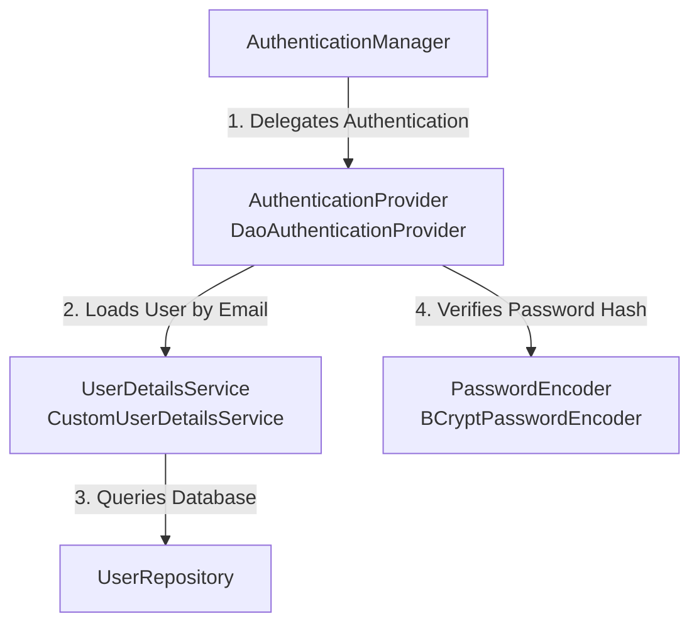

Welcome to **Chunk 3**! Now that our database domain (`User`) and cryptographic engine (`JwtService`) are ready, we need to build the core engine of Spring Security: **How Spring Security connects to our PostgreSQL database and checks passwords**.

In this chunk, we will create two classes:
1. `CustomUserDetailsService.java` (Inside `com.easybyte.bank.security`)
2. `ApplicationConfig.java` (Inside `com.easybyte.bank.config`)

---

### 🧠 1. Core Fundamentals: The Spring Security Authentication Engine

Before writing code, let’s understand the exact division of labor when a user tries to log in. Four key interfaces work together:



1. **`UserDetailsService`**: This is a functional interface with a single method: `loadUserByUsername(String username)`. Its sole job is to fetch user records from our database (using `UserRepository`) and hand them back to Spring Security as a `UserDetails` object.
2. **`PasswordEncoder` (`BCryptPasswordEncoder`)**: Never store raw plaintext passwords! `BCrypt` applies a cryptographic hash with a random salt. When a user logs in, Spring compares their typed password against our stored hash using this bean.
3. **`AuthenticationProvider` (`DaoAuthenticationProvider`)**: The brain of traditional authentication. It takes the user's submitted credentials, calls `UserDetailsService` to load the database record, and uses `PasswordEncoder` to verify if the passwords match.
4. **`AuthenticationManager`**: The main coordinator (`authenticate()` method) that our `AuthController` will invoke when a login request arrives.

---

### 🛠️ 2. Production-Grade Code: `CustomUserDetailsService.java`

Let's create our custom `UserDetailsService` implementation inside `src/main/java/com/easybyte/bank/security/CustomUserDetailsService.java`.

```java
package com.easybyte.bank.security;

import com.easybyte.bank.user.UserRepository;
import lombok.RequiredArgsConstructor;
import org.springframework.security.core.userdetails.UserDetails;
import org.springframework.security.core.userdetails.UserDetailsService;
import org.springframework.security.core.userdetails.UsernameNotFoundException;
import org.springframework.stereotype.Service;

@Service
@RequiredArgsConstructor
public class CustomUserDetailsService implements UserDetailsService {

    private final UserRepository userRepository;

    /**
     * Spring Security calls this method automatically whenever it needs to inspect a user during login
     * or when verifying a JWT token in our custom filter.
     * 
     * Note: Even though the parameter is named 'username', we pass the user's unique email address.
     */
    @Override
    public UserDetails loadUserByUsername(String username) throws UsernameNotFoundException {
        return userRepository.findByEmail(username)
                .orElseThrow(() -> new UsernameNotFoundException("User not found with email: " + username));
    }
}
```

#### **Deep Dive: Why `@RequiredArgsConstructor`?**
Instead of using `@Autowired` on field variables (which makes testing harder and hides dependency requirements), we use Lombok's `@RequiredArgsConstructor` combined with a `private final UserRepository` field. Spring automatically injects `UserRepository` through constructor injection at runtime—this is an industry-standard **best practice**.

---

### 🛠️ 3. Production-Grade Code: `ApplicationConfig.java`

Now let's wire our authentication beans together. Create this file inside `src/main/java/com/easybyte/bank/config/ApplicationConfig.java`.

```java
package com.easybyte.bank.config;

import com.easybyte.bank.security.CustomUserDetailsService;
import lombok.RequiredArgsConstructor;
import org.springframework.context.annotation.Bean;
import org.springframework.context.annotation.Configuration;
import org.springframework.security.authentication.AuthenticationManager;
import org.springframework.security.authentication.AuthenticationProvider;
import org.springframework.security.authentication.dao.DaoAuthenticationProvider;
import org.springframework.security.config.annotation.authentication.configuration.AuthenticationConfiguration;
import org.springframework.security.crypto.bcrypt.BCryptPasswordEncoder;
import org.springframework.security.crypto.password.PasswordEncoder;

@Configuration
@RequiredArgsConstructor
public class ApplicationConfig {

    private final CustomUserDetailsService userDetailsService;

    /**
     * Configures the DaoAuthenticationProvider to use our custom UserDetailsService and BCrypt password encoder.
     */
    @Bean
    public AuthenticationProvider authenticationProvider() {
        DaoAuthenticationProvider authProvider = new DaoAuthenticationProvider();
        authProvider.setUserDetailsService(userDetailsService);
        authProvider.setPasswordEncoder(passwordEncoder());
        return authProvider;
    }

    /**
     * Exposes the AuthenticationManager as a Spring Bean so we can inject it into our AuthController
     * to authenticate users during the login (/api/auth/login) process.
     */
    @Bean
    public AuthenticationManager authenticationManager(AuthenticationConfiguration config) throws Exception {
        return config.getAuthenticationManager();
    }

    /**
     * BCrypt applies a strong one-way hashing algorithm with built-in salting.
     */
    @Bean
    public PasswordEncoder passwordEncoder() {
        return new BCryptPasswordEncoder();
    }
}
```

#### **Deep Dive: Key Annotations & Beans Explained**
* **`@Configuration`**: Tells Spring that this class declares `@Bean` methods. When Spring boots up, it executes these methods and stores the returned objects (`passwordEncoder`, `authenticationProvider`, `authenticationManager`) inside the Spring Application Context.
* **`DaoAuthenticationProvider`**: Notice how we plug in `authProvider.setUserDetailsService(userDetailsService)` and `authProvider.setPasswordEncoder(passwordEncoder())`. Now Spring Security knows *exactly* how to query PostgreSQL (`findByEmail`) and how to check passwords (`BCrypt`)!

---

### ✅ Your Action Items for Chunk 3:
1. Create `CustomUserDetailsService.java` inside your `com.easybyte.bank.security` package.
2. Create `ApplicationConfig.java` inside your `com.easybyte.bank.config` package.
3. Run `mvn clean compile` or boot your application to verify there are no compilation errors or missing bean wiring.

Take your time to understand how these four pieces (`UserDetailsService`, `PasswordEncoder`, `AuthenticationProvider`, and `AuthenticationManager`) communicate with each other. Once you are comfortable or if you have **any questions** about this chunk, let me know and we will proceed to **Chunk 4: The Heart of Stateless Security — Building our `JwtAuthenticationFilter`!**